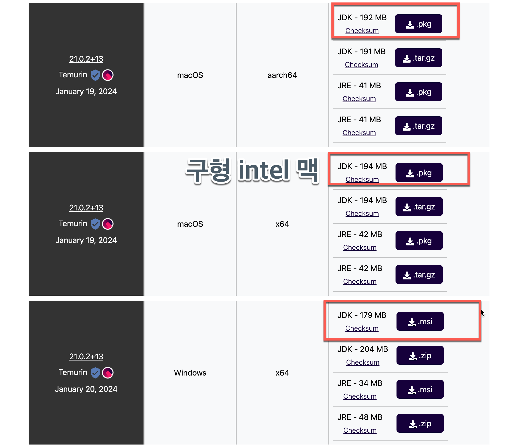

# 🎉 즐거운 자바

## 👩‍🏫 강사 소개  
**강경미** (carami@nate.com), **김성박** (urstory@gmail.com)

---

## 🧠 JAVA 언어의 특징과 JDK 설치

### 자바 프로그래밍을 공부하는 이유

- ✅ 기업에서 서버 프로그래밍 시 가장 많이 사용하는 언어

---

### 자바 언어의 특징

- 객체지향 언어
- 자바 언어는 느리지만, 버전업되면서 다른 언어들의 장점을 흡수하고 있다 (**모던 자바**)
  - ✅ **람다(Lambda)** : 함수형 프로그래밍
  - ✅ **Stream API** : 람다 표현식과 메서드 참조 등을 결합해 복잡한 데이터 처리를 쉽게 가능하게 함
  - ✅ **병렬 프로그래밍** : 여러 CPU 코어에서 작업을 나눠 동시에 처리

---

## 💻 자바 프로그램 작성과 실행 (개요)

- JDK (Java Development Kit)를 설치해야 함
- 여러 종류의 JDK가 존재:
  - OpenJDK, Oracle JDK, Azul Zulu JDK, Amazon Corretto, Adoptium Temurin 등
- 이클립스 재단의 **Adoptium Temurin**은 안정적인 오픈JDK 빌드 제공

---

## 🔧 Git 설치 및 환경 설정

```bash
git config --global user.name "이름"
git config --global user.email "이메일"
git config --global core.autocrlf true
```

---

## 🛠️ JDK 21 설치 개요

- 초보자는 JDK 8도 충분하지만, 기업들은 보통 11 이상 사용
- ✅ JDK 17 (2023년 LTS)  
- ✅ JDK 21 (2024년 LTS) → 더 긴 유지보수 기간  
- [공식 설치 사이트 - Adoptium](https://adoptium.net/)



---

## 🍎 Mac에서 JDK 21 설치

### 설치

- `.pkg` 파일 다운로드 후 설치

### 환경 변수 설정

```bash
# 터미널에서 사용 중인 쉘 확인
echo $0

# zsh인 경우
code ~/.zshrc

# bash인 경우
code ~/.bashrc
```

```bash
# 마지막 줄에 추가
export JAVA_HOME=$(/usr/libexec/java_home -v 21)
export PATH=$PATH:$JAVA_HOME/bin
```

### 설치 확인

```bash
java --version
javac -version
```

---

## 🪟 윈도우에서 JDK 21 설치

- `.msi` 파일 다운로드 후 설치
- 환경변수 설정은 아래 블로그 참고:  
  👉 [JAVA_HOME 설정 방법 (Windows)](https://vmpo.tistory.com/6)

---

## ✍️ 자바 첫 프로그램 작성

### 1. 코드 작성

```bash
code Hello.java
```

```java
public class Hello {
    public static void main(String[] args) {
        System.out.println("Hello");
    }
}
```

---

### 2. 컴파일 & 실행

```bash
javac Hello.java      # 컴파일 → Hello.class 생성
ls -la                # 파일 목록 확인
java Hello            # 실행 (확장자 생략)
```

---

## 🙏 마무리

- 수고하셨습니다! 🎉  
- 이제 여러분은 자바 개발을 위한 기초를 다졌습니다.


---

## ✅ 학습 체크리스트

| 항목 | 확인 |
|------|------|
| JDK 종류와 특징을 이해했다 | ⬜ |
| Git 설치 및 사용자 정보 설정을 완료했다 | ⬜ |
| JDK를 설치하고 환경변수 설정을 완료했다 | ⬜ |
| `Hello.java`를 작성하고 컴파일/실행에 성공했다 | ⬜ |
| `java`, `javac` 명령어 차이를 이해했다 | ⬜ |

---

## 🧪 실습 문제

1. **Git 사용자 정보 설정하기**
    - 이름: 자신의 이름
    - 이메일: 자주 사용하는 이메일

2. **자바 파일 생성 및 실행**
    - `Hello.java`를 생성하고 컴파일한 후 실행 결과 확인
    - `javac Hello.java`, `java Hello` 명령 실행

3. **환경 변수 확인 실습**
    - `echo $JAVA_HOME` 명령어를 통해 정상 설정 여부 확인
    - `java --version`, `javac -version`으로 버전 확인

4. **자신만의 메시지를 출력하는 자바 프로그램 작성**
    ```java
    public class MyName {
        public static void main(String[] args) {
            System.out.println("나는 백엔드 개발자가 될거야!");
        }
    }
    ```

---

## 💡 퀴즈

1. 자바를 실행할 수 있게 해주는 프로그램은 무엇인가요?
    - a) JVM  
    - b) JDK  
    - c) JRE  
    - d) IntelliJ  

2. 다음 중 자바의 특징이 아닌 것은?
    - a) 객체지향 언어  
    - b) 느리지만 안정성이 높음  
    - c) 플랫폼 의존성이 큼  
    - d) 병렬 프로그래밍 지원

3. `javac Hello.java` 명령어의 역할은?
    - a) 자바 프로그램을 실행한다  
    - b) 자바 소스를 컴파일하여 바이트코드로 변환한다  
    - c) JVM을 종료한다  
    - d) 환경 변수를 설정한다

---

> 정답:
> 1️⃣ a) JVM  
> 2️⃣ c) 플랫폼 의존성이 큼  
> 3️⃣ b) 자바 소스를 컴파일하여 바이트코드로 변환한다

---

📚 계속 학습을 이어가세요! 다음 시간에는 **자바의 변수와 자료형**에 대해 배워볼 거예요!  
궁금한 점이 있으면 언제든 질문해 주세요 😊
